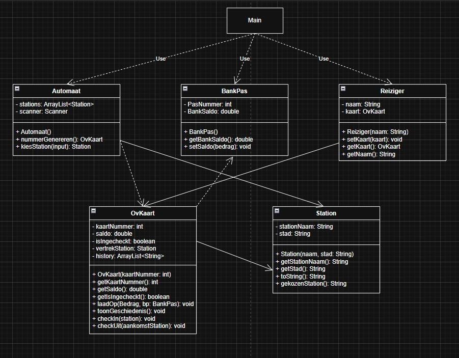

# OV-Chipkaart Systeem (Console Applicatie inplaats van JavaFX)

Dit is het ontwerp van de OV-chipkaart applicatie (Console versie). Dit document beschrijft precies wat wat doet.

## 1. Doel van de Applicatie
Het idee van deze project / applicatie is om een simpel OV-chipkaart systeem te maken dat in de console werkt. Je kunt hierbij een OV-kaart aanvragen, geld erop zetten met een bankpas, in- en uitchecken bij stations en een lijst van je ritten zien.

---

## 2. User Stories (Functionaliteiten)

Deze user stories vormen de uitgebreide versie van het project. De functionaliteiten die nog niet in de huidige console-applicatie zitten, worden gebouwd in de aanstaande JavaFX versie.

### Transport & Kosten (Meeste functies zijn voor de JavaFX versie)
| ID | User Story | Status |
|---|---|---|
| US-1 | **Als** reiziger **wil ik** kunnen in- en uitchecken bij een station, **zodat** mijn rit geregistreerd wordt en ik niet zwartrij. | In Huidige Code |
| US-2 | **Als** reiziger **wil ik** binnen 35 minuten kunnen overstappen zonder opnieuw het basistarief te betalen, **zodat** mijn reis betaalbaar blijft. | *JavaFX versie* |
| US-3 | **Als** vervoerder **wil ik** reizigers in de spits een toeslag rekenen, **zodat** ik de drukte in de treinen beter kan spreiden. | *JavaFX versie* |

### Financieel
| ID | User Story | Status |
|---|---|---|
| US-1 | **Als** vergeetachtige reiziger **wil ik** dat mijn saldo automatisch wordt opgewaardeerd, **zodat** ik nooit voor een gesloten poortje sta. | *JavaFX versie* |
| US-2 | **Als** trouwe reiziger **wil ik** punten sparen met mijn ritten, **zodat** ik deze later kan inwisselen voor gratis saldo. | *JavaFX versie* |
| US-3 | **Als** abonnementhouder **wil ik** een lagere boete bij een vergeten uitcheck, **zodat** een foutje me niet direct €20 kost. | *JavaFX versie* |

### Extra Functionaliteiten
| ID | User Story | Status |
|---|---|---|
| US-1 | **Als** reiziger **wil ik** op het station een fiets kunnen huren met mijn kaart, **zodat** ik makkelijk de 'last mile' naar mijn werk kan afleggen. | *JavaFX versie* |
| US-2 | **Als** toerist **wil ik** voor een vast bedrag een dagkaart kunnen kopen, **zodat** ik onbeperkt door Nederland kan reizen zonder op mijn saldo te letten. | *JavaFX versie* |

---

## 3. Class Lijst (Objecten | Van de console versie)

Dit zijn de classes in de code.

### `Main`
* **Wat is het:** Start het programma.
* **Bezit:** Niets speciaals (direct).
* **Wat doet het:** Laat het menu zien op je scherm, leest wat je intypt, en regelt de rest via de andere objecten. Bevat de main loop natuurlijk.

### `Automaat`
* **Wat is het:** De machine die de stations instelt en nieuwe kaarten aanmaakt.
* **Bezit (Variabelen):** Lijst met stations, Scanner voor input.
* **Wat doet het (Methodes):** Kaartnummer genereren, een station kiezen.

### `BankPas` *(Uitbreiding)*
* **Wat is het:** De bankpas van de reiziger waarmee je de OV-kaart oplaadt.
* **Bezit (Variabelen):** PasNummer, BankSaldo.
* **Wat doet het (Methodes):** Banksaldo ophalen, geld eraf halen.

### `OvKaart`
* **Wat is het:** De OV-chipkaart waarmee je reist.
* **Bezit (Variabelen):** KaartNummer, Saldo, isIngecheckt, VertrekStation, Reisgeschiedenis (Bonus).
* **Wat doet het (Methodes):** Opladen met geld, ritten laten zien, inchecken en uitchecken.

### `Reiziger`
* **Wat is het:** De persoon die de app of ov-kaart gebruikt.
* **Bezit (Variabelen):** Naam, OvKaart.
* **Wat doet het (Methodes):** Naam onthouden, kaart eraan vastmaken.

### `Station`
* **Wat is het:** Waar je opstapt of uitstapt.
* **Bezit (Variabelen):** StationNaam, Stad.
* **Wat doet het (Methodes):** De naam en de stad ophalen om op het scherm te tonen.

---

## 4. Class Diagram (UML) Structuur

